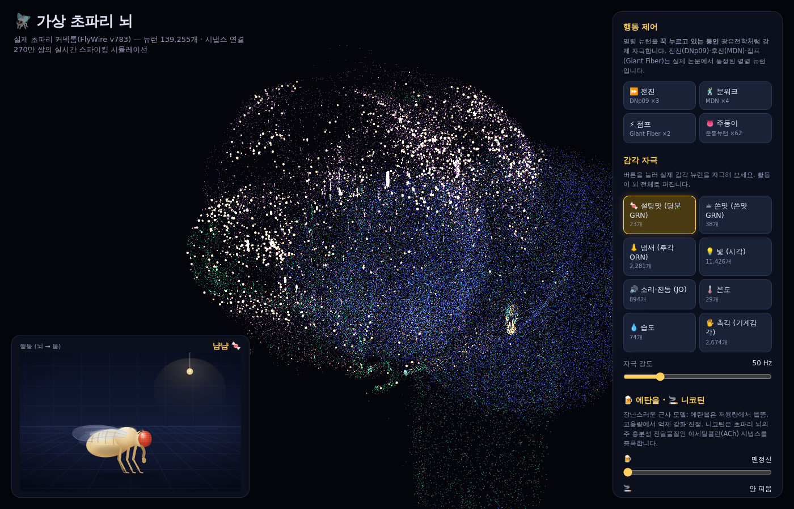
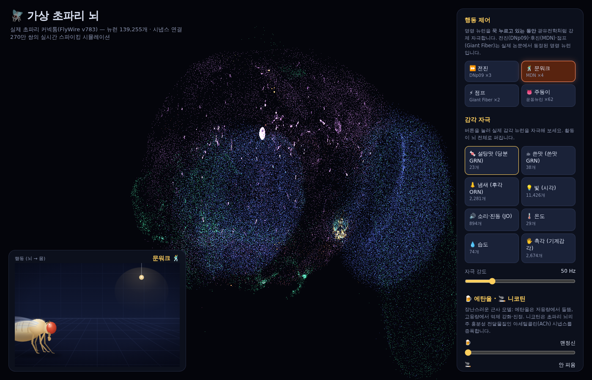
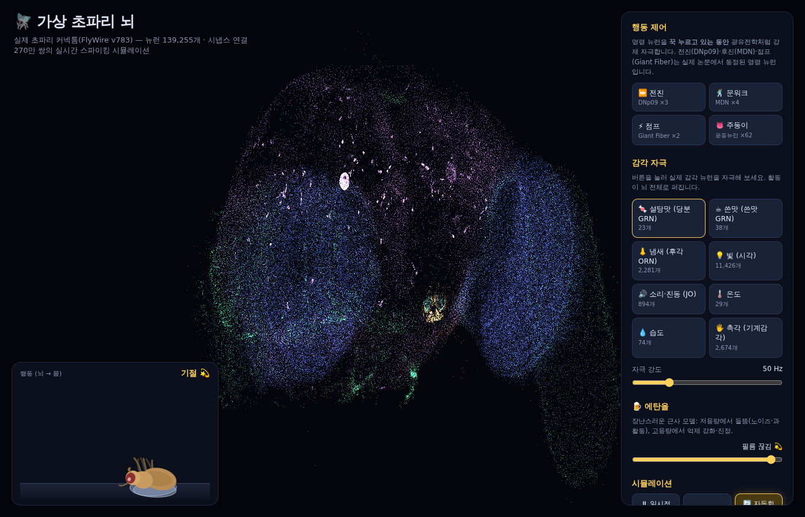
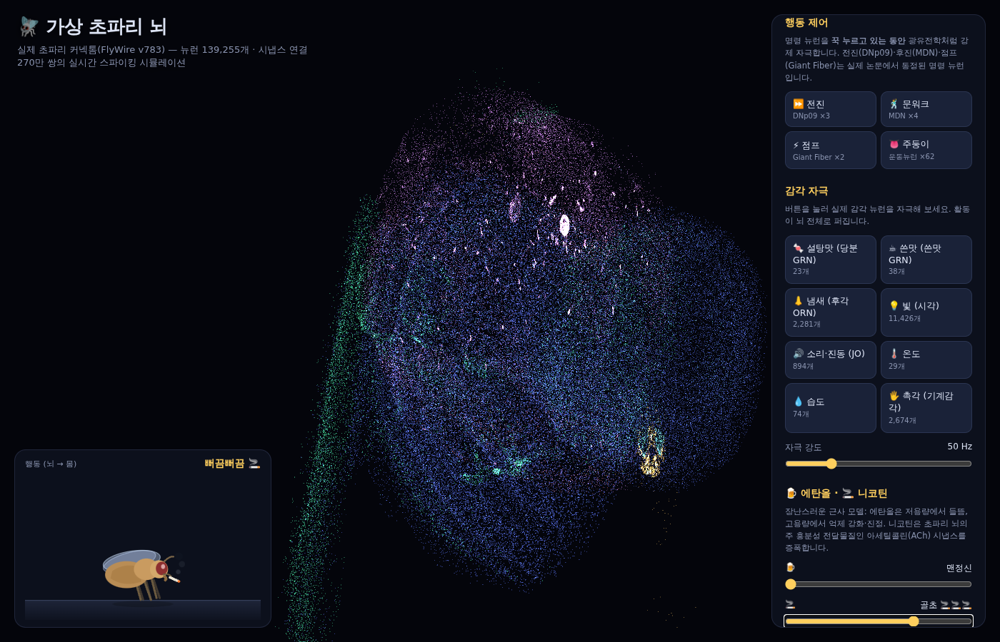

# 🪰 가상 초파리 뇌 (Virtual Fly Brain)

실제 초파리(*Drosophila melanogaster*) 커넥톰 데이터로 돌아가는 **브라우저 스파이킹 뇌 시뮬레이터**.

FlyWire 프로젝트가 공개한 성체 초파리 뇌 전체 배선도 — **뉴런 139,255개, 시냅스 연결 270만 쌍** — 를
leaky integrate-and-fire(LIF) 모델로 실시간 시뮬레이션하고, WebGL 포인트 클라우드로 렌더링합니다.

- **감각 자극**: 설탕맛·쓴맛·냄새·빛·소리 같은 실제 감각 뉴런을 자극하면 활동이 뇌 전체로 퍼집니다
- **행동 아바타**: 운동·하행 뉴런의 발화를 읽어 화면 속 초파리가 실제로 걷고, 점프하고, 주둥이를 뻗습니다
- **행동 제어**: MDN(문워커)·DNp09·Giant Fiber 같은 실제 명령 뉴런을 광유전학처럼 강제 자극해 조종합니다
- **🍺 에탄올 / 🚬 니코틴**: 만취해서 비틀거리다 기절하는 초파리, 담배 무는 초파리도 만들 수 있습니다



## 실행 방법

```bash
# 1) 커넥톰 데이터 준비 (web/data/ 가 비어 있는 경우 한 번만, 수 분 소요)
cd pipeline
pip install pandas numpy
python3 build_dataset.py --download --src flywire_csv --out ../web/data

# 2) 정적 서버로 실행
cd ../web
python3 -m http.server 8000
# 브라우저에서 http://localhost:8000 접속
```

- **감각 자극** 버튼: 실제 논문에서 식별된 감각 뉴런 집단을 포아송 발화로 자극
  - 🍬 설탕맛 GRN (23개) / ☕ 쓴맛 GRN (38개) — Engert et al. 2022, Shiu et al. 2022 라벨
  - 👃 후각 ORN (2,281개), 💡 시각 (11,426개), 🔊 존스턴 기관 JO (894개), 🌡️ 온도, 💧 습도, 🖐️ 기계감각
- **행동 제어** 버튼: 문헌에서 동정된 명령 뉴런을 꾹 누르는 동안 130Hz로 강제 자극
  - ⏩ 전진 DNp09 (Bidaye et al. 2020) / 🕺 문워크 MDN (Bidaye et al. 2014)
  - ⚡ 점프 Giant Fiber / 👅 주둥이 운동뉴런 (Sterne et al. 2021)
- **행동 아바타**: 판독 그룹(DNp09·MDN·GF·주둥이 MN·하행뉴런)의 발화율을 전뇌 평균 대비
  상대 신호로 읽어 걷기/문워크/점프/섭식을 구동. 설탕 자극 → 주둥이 뻗기는
  Shiu et al. 2024가 모델로 재현한 실제 회로가 그대로 작동하는 것
- **🍺 에탄올 / 🚬 니코틴** 슬라이더: 에탄올은 저용량 들뜸 → 고용량 억제 강화·진정(기절),
  니코틴은 ACh(초파리 뇌의 주 흥분성 전달물질) 시냅스 증폭. 실제 약리 모델이 아닌 장난스러운 근사입니다.
- 드래그로 회전, 휠로 확대·축소. 색은 뉴런 super_class(시엽/중심뇌/감각/운동 등) 기준.

| 문워크 제어 | 만취 기절 | 흡연 |
|---|---|---|
|  |  |  |

## 실험실: 초파리 눈으로 보는 TV · 탁구 · 오목 대결

### 초파리 눈 (`pipeline/build_vision.py`)

1. **망막 지도** — R1-6 광수용체 8,456개의 좌표를 눈마다 PCA로 펼쳐 화면 좌표에 매핑
   (왼눈 = 화면 왼쪽 절반, 오른눈 = 오른쪽 절반, 정면이 가운데).
2. **수용장 측정** — 웹 워커와 같은 LIF 모델을 numpy로 돌리며 화면을 20×14칸으로 나눠
   한 칸씩 비추고, 각 시각 뉴런이 화면 어디에 반응하는지 측정. 이 모델에서는 활동이
   수 ms 만에 뇌 전체로 연쇄 확산되므로 첫 반응 파동(20ms)만 센다. 국소 수용장을 가진
   시각 뉴런 2,670개(대부분 시엽)가 화면 280칸 중 212칸을 덮는다.
3. **검증(numpy)** — 정지한 공 위치 해독 오차 중앙값 화면 폭의 2.4%, 움직이는 공 추적
   대부분 5% 이내, 9×9 오목판 돌 위치 판별 AUC 0.84~0.95.
   반면 자이언트 파이버는 다가오는 원(24회)과 정지한 원(23회)을 구분하지 못했다 —
   단순 LIF의 연쇄 확산 때문에 강한 시각 자극은 무엇이든 점프 회로를 깨운다.

### 📺 TV · 🏓 탁구

- 화면 캔버스 → 광수용체 발화율 → 연결체 → 시각 뉴런. 카드 오른쪽 그림은 시각 뉴런
  반응을 그 뉴런의 수용장 위치에 그린 "뇌가 본 화면"이다. 3D 장면의 TV에도 같은 화면이 나온다.
- 탁구 패들은 **뇌의 정위 반응**으로 움직인다: 시각 뉴런이 공을 가장 강하게 본 위치로 간다.
  학습된 디코더나 정답 신호는 없다. 공을 치면 설탕 미각 뉴런 + 보상 도파민(PAM),
  놓치면 쓴맛 + 처벌 도파민(PPL1)을 자극한다.
- 좌우 하행뉴런 발화 차이로 조종하는 방식은 쓰지 않았다 — 공 위치와 무관하게 오른쪽이
  항상 우세해 방향 정보가 없었다.

### ⚫ 초파리 두 마리 오목 대결

- 초파리 A·B는 각자 별도 워커에서 도는 전체 연결체 뇌다(같은 연결체로 시작).
- **수 선택**: 판을 20ms 보여주고(내 돌 밝게, 상대 돌 어둡게, 판 선 희미하게)
  그 뇌의 시각 뉴런 반응이 가장 강한 빈 칸에 둔다. 규칙·점수표·선생님은 없고
  5목 판정은 심판만 한다. numpy 검증에서 뇌가 고른 칸은 매번 돌 옆이었다.
- **학습(조련사식 3요소 가소성)**: 🎓 조련 훈련에서는 수가 놓일 때마다 조련사(심판)가
  결과만 보고 칭찬(설탕 + 보상 도파민 PAM)이나 꾸지람(쓴맛 + 처벌 도파민 PPL1)을 준다.
  그 수를 고르게 만든 시냅스, 즉 고른 칸을 보는 시각 뉴런으로 들어가며 직전 판 보기에서
  함께 발화한 입력만 `Δw = η·r·√(pre·post/최대)·w`로 강화·약화된다. 조련사는 수를 대신
  고르지 않는다. ▶ 대결은 학습 없이 실력만 겨룬다.
- **보관(공유 저장소)**: 초파리마다 훈련으로 바뀐 시냅스(인덱스 + 가중치, varint·float32 → base64
  조각)와 승패·조련 이력이 아티팩트 db에 저장된다(`web/js/brain-store.js`, `flies/<id>`). 링크로
  들어온 사람은 누구나(로그인 필요) 그 뇌를 이어받아 대결시키거나 더 가르칠 수 있고, 저장(쓰기)은
  주인·편집자만 된다. 카드의 발전 그래프가 누적 조련 전체의 칭찬 비율과 이동 평균을 보여 준다.
  "지금까지 바뀐 시냅스"는 처음부터 한 번이라도 바뀐 시냅스 수(중복 없음)라서 줄어들지 않는다.
- **바뀔 수 있는 시냅스의 한계**: 학습은 고른 칸(탁구는 공을 본 열)의 시각 뉴런으로 들어가는 시냅스만
  건드린다. 오목판 영역을 보는 시각 뉴런 1,656개로 들어가는 시냅스는 28,187개(전체 270만 개의 1%),
  탁구까지 합치면 42,854개가 최대치다. 실제로는 판을 보는 짧은 순간에 함께 발화한 입력만 바뀌므로
  오목 200판에서 약 1만 개로 거의 포화되고, 그 뒤에는 같은 시냅스의 세기가 계속 조정된다.
- **세기 한계**: 학습된 세기는 원래(시냅스 개수)의 0.05~4배로 묶인다. 처음 버전에는 한계가 없어
  200판 조련한 저장본에서 일부 시냅스가 수억 배까지 커졌다(100배 이상 70개, 1만 배 이상 10개).
  이런 시냅스는 스파이크 하나로 목표 뉴런을 강제로 켜거나 끈다. 저장본을 불러올 때도 같은 한계를 적용한다.
  한계 전후 실력 비교(그 저장본 vs 원래 연결체, 16판, 학습 없음): B는 한계 없이 14승 2패, 한계 적용 14승 2패로
  같았고, A는 8승 8패 → 9승 7패. 원래 vs 원래는 11승 5패(16판의 잡음 폭).
- **판 보는 시간 40ms → 20ms**: 같은 비교에서 B 15승 1패, A 11승 5패로 실력 차이 없이 수당 시간이 절반이 됐다.
- **학습 개선 (조련사는 여전히 결과만 판정하고, 수는 뇌가 고른다)**: 302판 조련된 저장본을 분석해 보니
  두 초파리 모두 판을 읽지 않고 '좋아하는 칸'을 외웠고(판이 바뀌어도 같은 칸), A는 B가 외운 대각선이
  자기 세로줄의 길목을 막아 5목을 만들지 못했으며, 둔 수의 33%가 '이길 수를 놓침'이었다(B 21%).
  꾸지람은 고른 칸만 약하게 할 뿐 두지 않은 정답 칸은 강해지지 않기 때문이다. 그래서 세 가지를 바꿨다.
  1. 판 내용에 반응한 입력만 학습: 뉴런마다 평소 발화 수를 지수평균으로 기억하고, 이번 판에서 그보다
     더 발화한 만큼만 학습 자격으로 친다(공분산 규칙). 판 선·배경처럼 늘 들어오는 입력은 빠진다.
  2. 보상 예측 오차: 조련사 판정에서 평소 받던 보상을 뺀 값을 도파민 신호로 쓴다.
  3. 조련 중 탐색: 반응 세기의 4제곱에 비례한 확률로 칸을 고른다(▶ 대결은 여전히 가장 센 칸).
  비교(원래 연결체 두 마리를 100판 조련 → 원래 초파리와 흑·백 12판씩, 학습 없음):
  새 규칙 A 21승 3패·B 20승 4패, 이길 수 놓침 14%·24%, 조련 중 칭찬 37→42%·41→48%.
  옛 규칙 A 22승 2패·B 17승 7패, 이길 수 놓침 43%·37%, 조련 중 칭찬 40→38%·41→37%.
  승률은 둘 다 높아 차이가 없고, 무작위 판 12개에서 고른 칸 종류(5~7종)도 그대로라 '좋아하는 칸' 경향이
  사라진 건 아니다. 각 조건 1회씩이라 잡음이 있다.
- **🗑 삭제**: 카드의 🗑를 두 번 누르면 그 초파리의 뇌 조각과 기록이 지워지고, 빈 자리에는 명단의
  다른 초파리가(없으면 새로 태어난 초파리가) 앉는다.
- **초파리 명단**: 경기장의 두 자리(흑/백, 아래/위)에 명단의 어떤 초파리든 앉힐 수 있고,
  ➕ 새 초파리는 원래 연결체 그대로 태어난다. 초파리마다 뇌·기록이 따로 저장된다.
- **♾️ 무한 조련**: 멈출 때까지 계속 가르치고 10판(탁구는 20점)마다 자동 저장. 오목 조련은 두 판을
  동시에(A 흑 판·B 흑 판) 진행해 두 뇌가 쉬지 않게 하고, 조련 중엔 뒤에서 도는 뇌 애니메이션을 멈춘다.
  측정: 수당 167ms → 88ms(분당 약 9판 → 16판, 헤드리스 크로미움 기준).
- **결과**: 처음 30판 측정에서는 칭찬 비율이 A 39%→43%, B 40%→40%로 잡음 수준이었다. 사이트에서
  200판까지 조련한 저장본은 20판 평균이 A 41%→55%, B 38%→69%로 올라갔다.

### 🏓 초파리 두 마리 탁구 대결

- 두 초파리가 마주 보고 친다(`web/js/pong-duel.js`). 게임 시간 0.1초마다 각자의 눈에 자기 시점 화면
  (공 + 자기 패들, B는 180° 돌려서)을 20ms 보여 주고, 공 대역에서 시각 뉴런 반응이 가장 강한 위치로
  패들이 간다(정위 반응). 상대 패들은 보이지 않는다. 두 뇌는 동시에 본다.
- 조련: 공이 자기 쪽으로 올 때마다 조련사가 떨어질 곳(조련사만 안다)으로 다가갔는지만 보고 칭찬·꾸지람,
  받아내면 +1(설탕 + PAM), 놓치면 −1(쓴맛 + PPL1). 뇌가 공을 본 열의 시각 뉴런으로 들어가며 방금
  함께 발화한 입력 시냅스만 바뀐다. 🧑 나 vs 아래: 마우스·손가락으로 위 패들을 움직인다.
- 조련 전에도 공을 받아내는 비율이 이미 80~95%라 오목보다 오를 여지가 적다.
- 에탄올을 넣으면 막 노이즈로 판을 잘못 보게 된다. 🧑 나 vs 초파리 A로 직접 둘 수도 있다.

## 구조

```
pipeline/build_dataset.py   FlyWire v783 공개 CSV → 브라우저용 바이너리 변환
pipeline/build_vision.py    망막 지도 + 수용장 측정 (numpy LIF) → vision.bin
web/index.html              UI (한국어)
web/js/sim-worker.js        LIF 시뮬레이션 (Web Worker, 139k 뉴런 실시간)
web/js/render.js            WebGL1 포인트 클라우드 렌더러 (의존성 없음)
web/js/main.js              데이터 로드 + 오케스트레이션
web/js/arena.js             경기장: 두 뇌 워커, 초파리 명단, 오목 + 조련사 훈련
web/js/pong-duel.js         탁구 대결·조련
web/js/brain-store.js       훈련된 뇌를 공유 저장소에 저장·불러오기
web/data/                   변환된 커넥톰 (~18MB: CSR 인접 구조 + 좌표 + 분류, 생성물)
```

### 시뮬레이션 모델

Shiu et al. 2024 (*Nature*, "A Drosophila computational brain model reveals
sensorimotor processing")의 관례를 단순화한 LIF 모델:

- 시냅스 가중치 = 부호 있는 시냅스 개수. 신경전달물질 예측에 따라
  ACH/DA/SER/OCT는 흥분(+), GABA/GLUT는 억제(−)
- 막 시간상수 10ms, 발화 임계값 25 시냅스 단위(≈ 7mV ÷ 0.275mV/시냅스), 불응기 2ms
- 스파이크 즉시 전달(delta synapse), 전도 지연 없음
- **적응형 임계값**(spike-frequency adaptation, +30/τ=100ms): 순수 LIF에서는 재귀
  회로가 한 번 점화되면 영구 폭주하므로, 발화할수록 임계값이 올라갔다가 서서히
  복귀하게 해서 자극을 끄면 활동이 소멸하도록 했습니다

### 데이터 파이프라인

`build_dataset.py`는 공개 버킷(`storage.googleapis.com/flywire-data/codex/data/fafb/783`)에서
약 60MB의 CSV를 내려받아 브라우저용 바이너리(~18MB)로 변환합니다.

## 데이터 출처와 인용

데이터: [FlyWire Connectome](https://codex.flywire.ai) v783 공개 스냅숏.
사용 조건은 FlyWire의 데이터 이용 약관을 따르며, 이용 시 아래 논문을 인용해야 합니다:

- Dorkenwald et al. 2024, *Nature* — Neuronal wiring diagram of an adult brain
- Schlegel et al. 2024, *Nature* — Whole-brain annotation and multi-connectome cell typing of Drosophila
- Shiu et al. 2024, *Nature* — A Drosophila computational brain model reveals sensorimotor processing (LIF 모델 참고)
